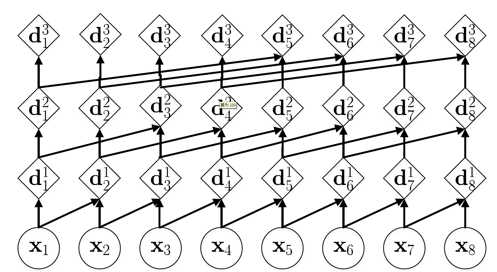
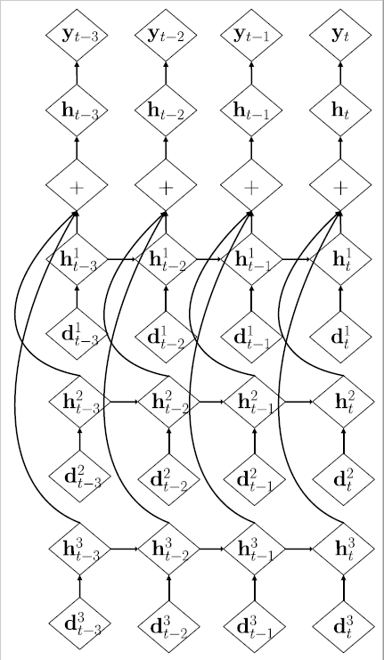

# Multi-Resolution-Convolutional-Recurrent-Network

In this repo, we implemented a new sequential model called multi-resolution convolutional recurrent network (MRCRN), which is a hybrid of TCNs and RNNs. Utilizing the representation learned by a TCN in different layers, RNN can capture context with different window size without modifying the architecture. Eventually, we show a significant improvements on language modeling and action recognition to support our arguments.

+ Encoder

+ Decoder

## Setting
* Hardware:
  * CPU: Intel Core i7-4930K @3.40 GHz
  * RAM: 64 GB DDR3-1600
  * GPU: GeForce GTX 1080ti
* pytorch 
* Dataset
  * Penn Treebank
  * UCF-101
